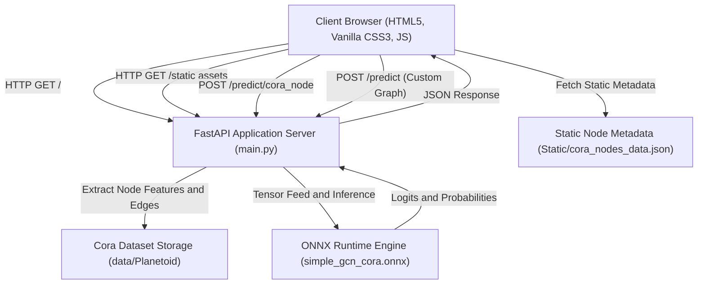

# Cora Citation Network GNN Explorer

[](https://cora-gnn-0qcn.onrender.com/)
[](https://www.python.org/)
[](https://fastapi.tiangolo.com/)
[](https://pyg.org/)
[](https://onnxruntime.ai/)
[](LICENSE)

An interactive, high-performance web platform for exploring, visualizing, and predicting academic research paper topics across the **Cora Citation Network** using a **Graph Convolutional Network (SimpleGCN)** exported to **ONNX Runtime**.

The application combines a high-throughput **FastAPI** backend with a responsive, dark-themed **HTML5 / Vanilla CSS3 / JavaScript** frontend for deep node feature inspection, ego-network topology rendering, and counterfactual "what-if" feature experimentation.

---

## Live Deployment

- **Application URL**: [https://cora-gnn-0qcn.onrender.com/](https://cora-gnn-0qcn.onrender.com/)
- **Swagger API Docs**: [https://cora-gnn-0qcn.onrender.com/docs](https://cora-gnn-0qcn.onrender.com/docs)
- **ReDoc Interface**: [https://cora-gnn-0qcn.onrender.com/redoc](https://cora-gnn-0qcn.onrender.com/redoc)

---

## Table of Contents

- [System Architecture](#system-architecture)
- [Cora Dataset Overview](#cora-dataset-overview)
- [Key Features](#key-features)
- [Directory Structure](#directory-structure)
- [API Reference](#api-reference)
- [Local Installation & Setup](#local-installation--setup)
- [Production Deployment](#production-deployment)
- [License](#license)

---

## System Architecture



---

## Cora Dataset Overview

The Cora dataset is a seminal citation network benchmark comprising computer science research publications:

| Metric | Specification |
| :--- | :--- |
| **Total Nodes (Papers)** | 2,708 |
| **Total Edges (Citations)** | 10,556 directed links (5,429 unique undirected edges) |
| **Feature Dimensions** | 1,433 binary attributes (Bag-of-Words vocabulary) |
| **Classification Classes** | 7 scientific disciplines |
| **Average Node Degree** | ~3.9 citations per paper |
| **Feature Density** | ~1.26% active words per abstract (high sparsity: ~98.74%) |

### Target Categories

| Class ID | Topic Name | Description |
| :---: | :--- | :--- |
| `0` | **Case_Based** | Case-based reasoning and memory-driven algorithms |
| `1` | **Genetic_Algorithms** | Evolutionary computation, genetic search, optimization |
| `2` | **Neural_Networks** | Deep learning, connectionist models, perceptrons |
| `3` | **Probabilistic_Methods** | Bayesian networks, graphical models, Markov decision processes |
| `4` | **Reinforcement_Learning** | Policy search, Q-learning, agent-environment dynamics |
| `5` | **Rule_Learning** | Inductive logic programming, decision trees, formal rules |
| `6` | **Theory** | Computational complexity, algorithms, discrete mathematics |

---

## Key Features

### 1. Interactive Node & Paper Selector
- Direct query input for any node ID (`0` to `2707`).
- Continuous range slider for rapid dataset scanning.
- Random node generator for exploratory sampling.
- Quick navigation to high-degree citation hubs (e.g., Paper `#1358` with 168 citations, Paper `#306` with 78 citations).
- Topic-based filtering to retrieve representative samples from specific classes.

### 2. Deep Feature Inspector
- Quantitative counters for Active Words (1s), Vector Density (%), and Sparsity (%).
- **1,433-Dimensional Spatial Density Heatmap**: High-resolution canvas rendering every single vocabulary index. Active word indicators glow; inactive entries remain muted. Includes live cursor tracking and index lookup.
- **Searchable Feature Pills**: Real-time filtering and querying of active feature indices with single-click clipboard copying.

### 3. "What-If" Counterfactual Feature Sandbox
- Interactive bit toggling: Inject or prune arbitrary word features from any paper.
- Real-time prediction comparison against baseline features via the `POST /predict` endpoint to study decision boundaries and stability.

### 4. Citation Graph Ego-Network Visualizer
- Dynamic canvas layout rendering the 1-hop neighborhood of the selected paper.
- Directed edge links, degree metrics, and class-coded neighbor nodes.
- Click-to-navigate interactions allowing users to traverse citation pathways across the graph.

### 5. Custom Graph Predictor
- Standalone experimentation mode for testing arbitrary 1,433-dimensional feature vectors and custom adjacency matrices.
- Built-in template presets for representative disciplines (Neural Networks, Genetics, Theory, Probabilistic Methods, Random Sparse).

---

## Directory Structure

```
GNN/
├── data/
│   └── Planetoid/
│       └── Cora/
│           └── raw/                   # Raw Cora graph and dictionary files
├── Static/
│   ├── index.html                     # Semantic HTML5 single-page application
│   ├── style.css                      # Modern dark-themed CSS design system
│   ├── app.js                         # Zero-dependency Vanilla JS application logic
│   └── cora_nodes_data.json           # Pre-extracted sparse active indices & neighbors
├── main.py                            # FastAPI server and ONNX Runtime inference service
├── requirements.txt                   # Production CPU dependencies
├── simple_gcn_cora.onnx               # Trained ONNX graph convolutional model
├── simple_gcn_cora.onnx.data          # Serialized model parameter weights
├── cora_citation_network_classfication.ipynb  # Training and evaluation notebook
├── graph_visualization.py             # NetworkX / Matplotlib graph export utility
├── graph_visualization.png            # Static network visualization plot
└── .gitignore                         # Repository ignore rules
```

---

## API Reference

### Health Check

```http
GET /health
```

<details>
<summary>Sample Response</summary>

```json
{
  "status": "Healthy",
  "providers": ["CPUExecutionProvider"]
}
```
</details>

---

### Model Metadata

```http
GET /model_info
```

<details>
<summary>Sample Response</summary>

```json
{
  "model_name": "SimpleGCN",
  "feature_dimension": 1433,
  "num_classes": 7,
  "class_mapping": {
    "0": "Case_Based",
    "1": "Genetic_Algorithms",
    "2": "Neural_Networks",
    "3": "Probabilistic_Methods",
    "4": "Reinforcement_Learning",
    "5": "Rule_Learning",
    "6": "Theory"
  },
  "inputs": [
    { "name": "node_features", "shape": ["batch_size", 1433], "type": "tensor(float)" },
    { "name": "edge_index", "shape": [2, "num_edges"], "type": "tensor(int64)" }
  ],
  "outputs": [
    { "name": "logits", "shape": ["batch_size", 7], "type": "tensor(float)" }
  ]
}
```
</details>

---

### Predict Cora Node by Index

```http
POST /predict/cora_node
Content-Type: application/json

{
  "node_index": [0]
}
```

<details>
<summary>Sample Response</summary>

```json
{
  "num_nodes": 2708,
  "num_edges": 10556,
  "predictions": [
    {
      "node_index": 0,
      "predicted_class_id": 2,
      "predicted_class_name": "Neural_Networks",
      "probability": [
        0.0076,
        0.0034,
        0.9542,
        0.0162,
        0.0098,
        0.0032,
        0.0056
      ],
      "logits": [
        -1.32,
        -2.14,
        3.54,
        -0.56,
        -1.06,
        -2.20,
        -1.62
      ]
    }
  ]
}
```
</details>

---

### Predict Custom Feature Vector & Graph

```http
POST /predict
Content-Type: application/json

{
  "node_feature": [
    [0.0, 0.0, 1.0, ..., 0.0]
  ],
  "edge_index": [
    [0],
    [0]
  ]
}
```

<details>
<summary>Sample cURL Request</summary>

```bash
curl -X POST "https://cora-gnn-0qcn.onrender.com/predict" \
     -H "Content-Type: application/json" \
     -d '{
       "node_feature": ['"$(python -c 'import json; print(json.dumps([1.0 if i in [19, 81, 146] else 0.0 for i in range(1433)]))')"',
       "edge_index": [[0], [0]]
     }'
```
</details>

---

## Local Installation & Setup

### Prerequisites
- Python 3.10, 3.11, or 3.12
- Git

### 1. Clone the Repository
```bash
git clone https://github.com/Viraj-Kumar-Sahu/GNN.git
cd GNN
```

### 2. Create and Activate a Virtual Environment
```bash
# On Linux / macOS:
python -m venv .venv
source .venv/bin/activate

# On Windows (PowerShell):
python -m venv .venv
.\.venv\Scripts\Activate.ps1
```

### 3. Install Dependencies
```bash
pip install --upgrade pip
pip install -r requirements.txt
```

### 4. Run the Development Server
```bash
uvicorn main:app --reload --host 127.0.0.1 --port 8000
```

Open your browser and navigate to:
```
http://127.0.0.1:8000
```

---

## Production Deployment

### Deployment on Render

This repository is pre-configured for deployment as a standard Web Service on Render:

1. Link your repository at [render.com](https://render.com).
2. Configure service settings:
   - **Environment**: `Python 3`
   - **Build Command**: `pip install -r requirements.txt`
   - **Start Command**: `uvicorn main:app --host 0.0.0.0 --port $PORT`
   - **Plan**: `Free`
3. Click **Deploy Web Service**.

---

## Technical Specifications

- **Model Framework**: PyTorch Geometric (PyG) converted to ONNX via `torch.onnx.export`.
- **Inference Runtime**: ONNX Runtime CPU (`CPUExecutionProvider`) for minimal resource overhead and rapid response times (< 15 ms).
- **Web Layer**: FastAPI with ASGI serving through Uvicorn.
- **Frontend Layer**: Zero third-party JavaScript frameworks; written in pure HTML5, modern CSS custom properties, and Vanilla JS.

---
